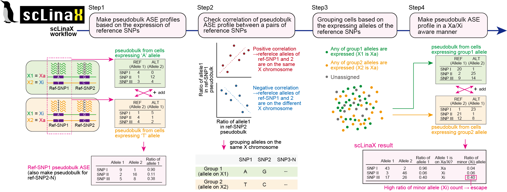
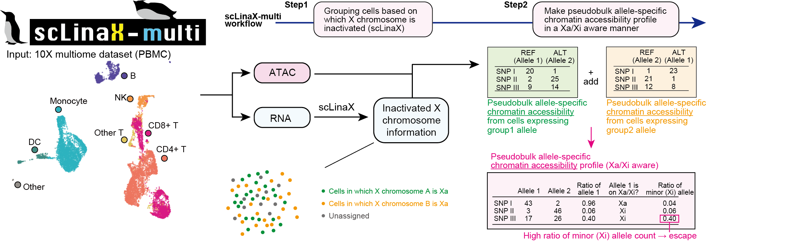

<!-- README.md is generated from README.Rmd. Please edit that file -->


# scLinaX
```{r, echo=FALSE, out.width="30%", fig.cap=""}
knitr::include_graphics("man/figures/scLinaX_and_scLinaX_multi_logo_hex.png")
```

<!-- badges: start -->
<!-- badges: end -->

scLinaX is software for the quantification of the escape from X chromosome inactivation (XCI).
Input of the scLinaX is a single-cell level allele-specific expression profile generated from single-cell RNA-seq (scRNA-seq) data (germline genotype data is optional).

```{r, echo=FALSE, out.width="100%", fig.cap="Overview of scLinaX"}

```


scLinaX also has an extension to the multi-modal single-cell omics data, scLinaX-multi.
scLinaX-multi can evaluate the escape from XCI at the chromatin accessibility level.
scLinaX-multi takes allele-specific read count data for both of the RNA and ATAC data.

```{r, echo=FALSE, out.width="100%", fig.cap="Overview of scLinaX-multi"}

```


## Installation

You can install the development version of scLinaX from [GitHub](https://github.com/) with:

``` r
# install.packages("devtools")
devtools::install_github("ytomofuji/scLinaX")
```

## User Guide
Please see [scLinaX User Guide](https://ytomofuji.github.io/scLinaX/).

## Contact
Yoshihiko Tomofuji: ytomofuji_at_sg.med.osaka-u.ac.jp

