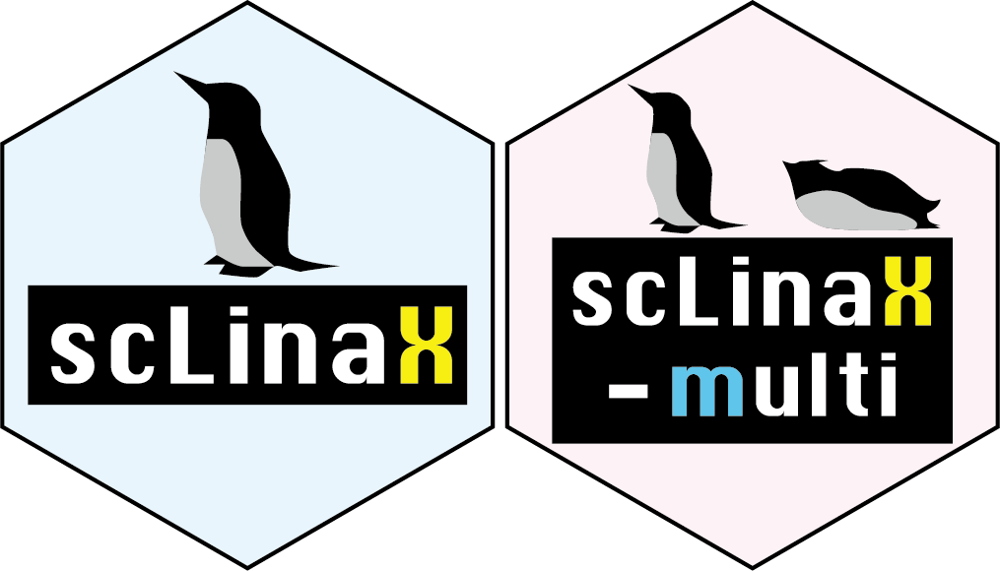
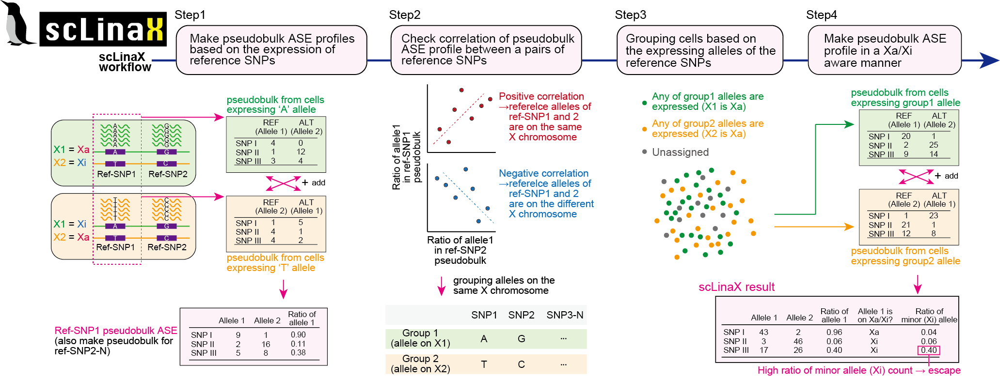
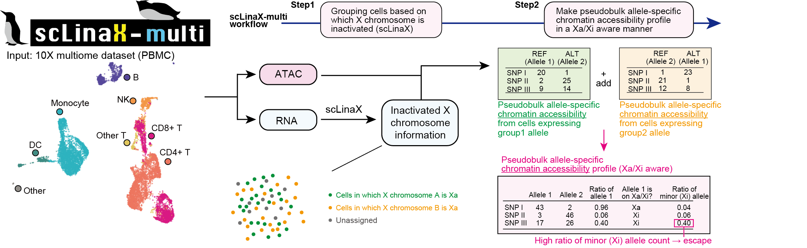

<!-- README.md is generated from README.Rmd. Please edit that file -->

# scLinaX



<!-- badges: start -->
<!-- badges: end -->

scLinaX is software for the quantification of the escape from X
chromosome inactivation (XCI). Input of the scLinaX is a single-cell
level allele-specific expression profile generated from single-cell
RNA-seq (scRNA-seq) data (germline genotype data is optional).

<div class="figure">


<p class="caption">
Overview of scLinaX
</p>

</div>

scLinaX also has an extension to the multi-modal single-cell omics data,
scLinaX-multi. scLinaX-multi can evaluate the escape from XCI at the
chromatin accessibility level. scLinaX-multi takes allele-specific read
count data for both of the RNA and ATAC data.

<div class="figure">


<p class="caption">
Overview of scLinaX-multi
</p>

</div>

## Installation

You can install the development version of scLinaX from
[GitHub](https://github.com/) with: For usage, please check our
vignette.

``` r
# install.packages("devtools")
devtools::install_github("ytomofuji/scLinaX")
```

## Contact

Yoshihiko Tomofuji: ytomofuji_at_sg.med.osaka-u.ac.jp
